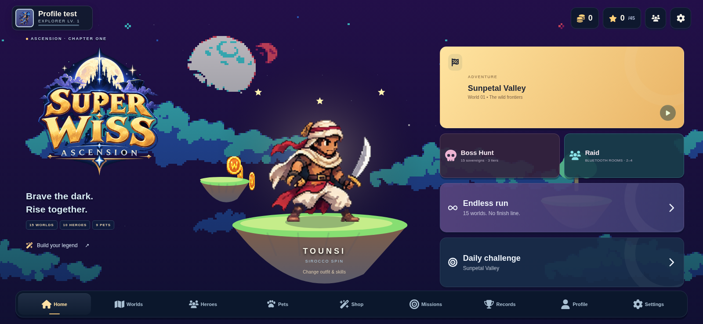
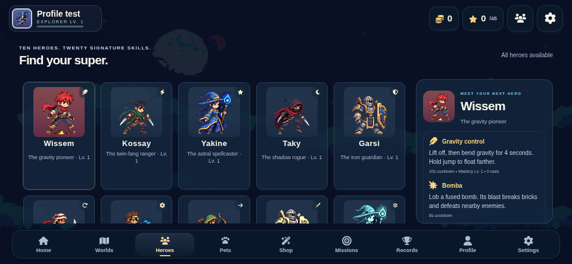

# Super Wiss Ascension — v1.3.1 source candidate

Weapon sprite integration, portrait/roster fixes and supplied-logo integration, based on the uploaded v1.3.0 source.

**No new APK or AAB was compiled in this delivery.** Gradle distribution download failed with `UnknownHostException: services.gradle.org`; this environment also lacks Android SDK/ADB. Old `artifacts/` reports/screenshots belong to previous builds. They do not validate these changes.

**Final weapon PNGs are pending.** The reference image was not extracted as art. Existing weapon-bearing hero sheets remain visible without procedural sticks; external weapons require the final PNGs plus weapon-free body/outfit sheets marked `weaponLayer: "separate"`. See [weapon handoff](assets/weapons/README.md).

## Source changes
- Remove both procedural weapon drawings, including cosmetic rods.
- Manifest/cache/sprite weapon pipeline keyed by actual COMBAT_PROFILES.weapon; per-frame grip sockets; shared attack-phase body/weapon motion.
- Explicit Rayan lance and Mira frost-staff/ice profiles. Loey label corrected to Sky bow. Preserve normalized PvP behavior.
- New solo results revision 4 avoids comparing changed combat directly with stored revision 3 results; existing save key/schema/origin unchanged.
- Identity card uses saved profile avatar, not equipped hero. Names/XP unchanged.
- Distinct still portraits with no combat overlays; bounded responsive roster and intentional scroll reset on re-entry.
- Supplied logo on Home/web loading/native fallback; supplied W derivative in adaptive/themed launcher.
- Optional pending-art support is limited to weapon entries. Missing required media still fails validation/normal boot.

## Read first
- [Pre-edit investigation and full original drawHeroWeapon](docs/reviews/1.3.1/INVESTIGATION.md)
- [Weapon PNG contract / enable real sprites](assets/weapons/README.md)
- [Current tests and native build blocker](docs/reviews/1.3.1/TEST-REPORT.md)
- [Quality follow-ups / unavailable private skills](docs/reviews/1.3.1/QUALITY-FOLLOWUPS.md)
- [Building](BUILDING.md)

## Build

```powershell
npm run validate
npm run build
npm test
npm run test:weapon-ui
npm run validate:maps
.\gradlew.bat :app:assembleDebug :app:assembleQa :app:bundleQa :app:lintDebug :app:lintQa
```

`npm run validate:weapon-art` intentionally fails until all ten final weapon PNGs are present. The included public QA certificate is only for local tests, never production.

Working game code: `game/`; metadata: `game/*.json`; source art: `assets/`; Android host: `app/src/main/java/`. Gradle preBuild regenerates the small shell and separate APK media; do not reintroduce giant HTML through native loadDataWithBaseURL. The standalone browser preview may embed media, but Android never loads that file.

The requested Agent Skills were unavailable when this patch was implemented. Subsequently supplied packs are now stored in `agent-skills/`, and ten target mockups in `design/references/ui/`. Their inclusion does not certify compliance or implement the mockup layouts.

## Repository use

This snapshot contains ordinary project files at the root. No split-pack restore or bootstrap is required. Open `settings.gradle` in Android Studio. Older v1.0.0 source packs, where present, are historical and are not current build input.

### Browser runtime previews

These are browser renders, not Android device-test evidence.




